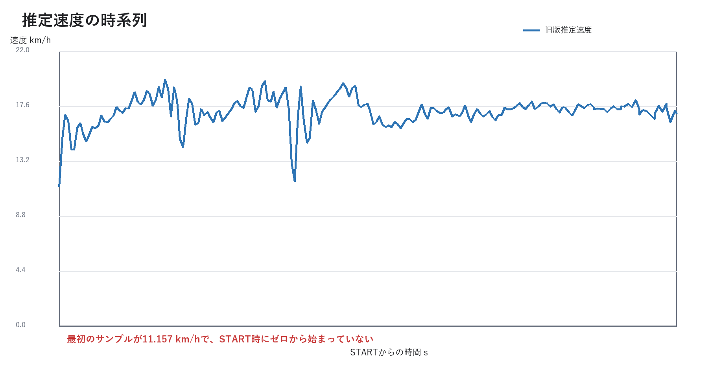
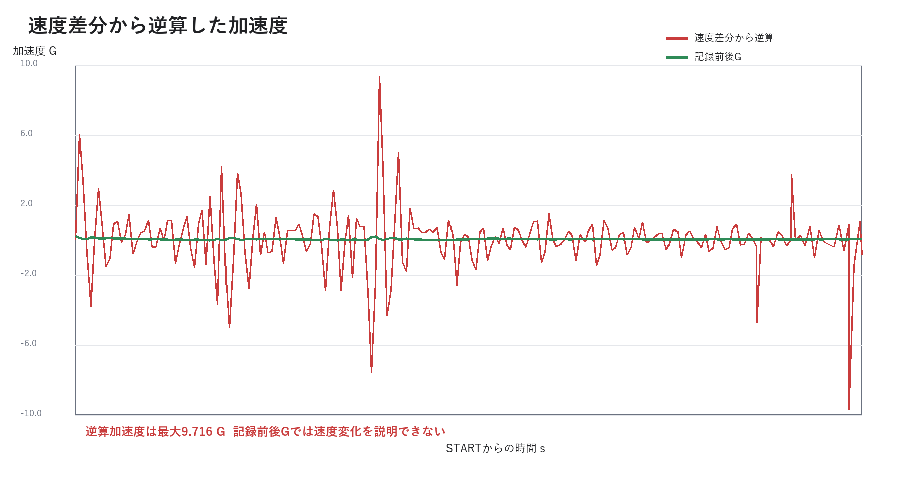
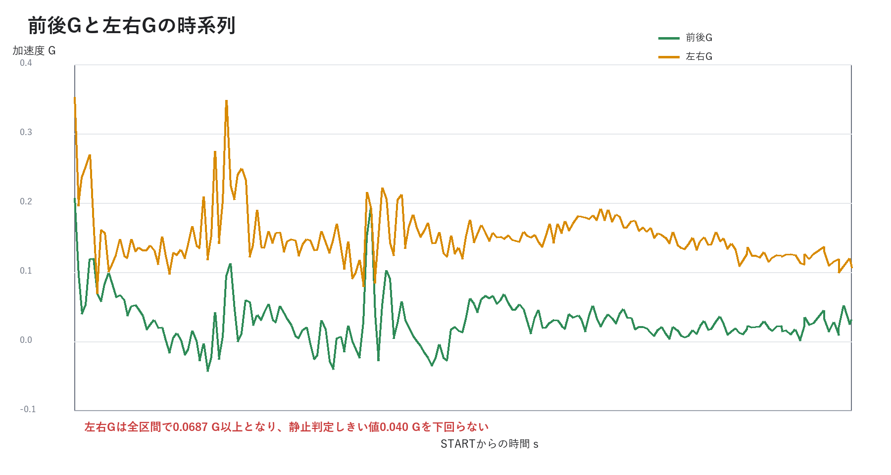
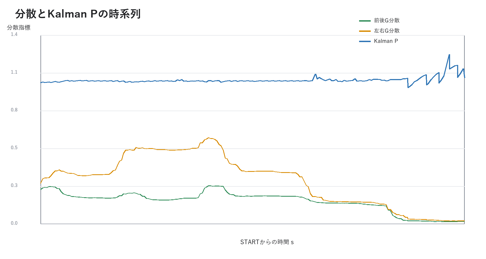

# Gym Ana 走行データ解析レポート

## 1. レポート情報

| 項目 | 内容 |
| --- | --- |
| 解析日 | 2026-09-20 |
| 主解析ファイル | `gym-ana-2026-09-13T04-44-31-036Z.csv` |
| SHA-256 | `5359017C3B2B7C3CF0CF5501748BB97700A9EA4A72BB3A895C0D8AA13C611406` |
| 解析対象アプリ | GPS融合修正前のログ形式 |
| 比較実装 | Git commit `f59a182be130f11aa9ed83ecd22f9a53a35af496` |

## 2. 結論

このログから、記録時点の速度推定値は実速度として使用できないと判断する。主な根拠は次のとおりである。

1. START直後の最初のサンプルがすでに`11.157 km/h`で、ゼロから開始していない。
2. 18 msで`3.816 km/h`増加しており、必要加速度は約`6.00 G`だが、記録前後Gは`0.2069 G`である。
3. 全区間の速度差分から逆算した加速度は、絶対値95パーセンタイルで`3.824 G`、最大`9.716 G`となり、記録Gと整合しない。
4. 左右G平均が`0.1509 G`で、前後G平均`0.0282 G`より大きい。端末座標、重力混入または前後軸判定の問題が疑われる。
5. 静止判定条件を満たすサンプルが0件で、ゼロ速度更新が一度も成立していない。

ただし、ログにはGPS速度、位置、動画、既知距離などの正解速度がない。このため「実速度に対して何km/hずれたか」は算定できない。上記はログ内部の物理整合性評価である。

## 3. データ範囲

### 3.1 主解析データ

| 指標 | 値 |
| --- | ---: |
| サンプル数 | 204 |
| イベント数 | 15 |
| 記録時間 | 3.406 s |
| 平均サンプリング周波数 | 59.01 Hz |
| サンプル間隔5パーセンタイル | 16 ms |
| サンプル間隔中央値 | 17 ms |
| サンプル間隔95パーセンタイル | 20 ms |
| 同一タイムスタンプの隣接組 | 2組 |
| 欠損速度行 | 0 |

約60 Hzで取得できており、サンプリング周期自体は速度推定に十分な水準である。同一タイムスタンプは`3200 ms`と`3284 ms`で各1組発生している。計算時は時間差ゼロの組を除外した。

### 3.2 旧形式データ

Downloadsには`gym-ana-2026-08-10T05-26-17-851Z.csv`も存在する。このファイルは`section`列や生サンプルを持たず、同様のイベント列が繰り返されている旧デモ形式である。実走データとの識別ができないため、統計解析対象から除外した。

## 4. 基本統計



| 指標 | 最小 | 平均 | 最大 | 標準偏差 |
| --- | ---: | ---: | ---: | ---: |
| 推定速度 km/h | 11.157 | 17.174 | 19.694 | 1.176 |
| 前後G | -0.0434 | 0.0282 | 0.2069 | 0.0343 |
| 左右G | 0.0687 | 0.1509 | 0.3526 | 0.0380 |
| バンク角 deg | 3.12 | 5.237 | 7.15 | 0.831 |
| ヨーレート deg/s | -16.25 | 0.422 | 18.95 | 4.349 |

| 補助指標 | 値 |
| --- | ---: |
| 前後G分散平均 | 0.162047 |
| 左右G分散平均 | 0.314008 |
| Kalman P最小 | 0.974424 |
| Kalman P最大 | 1.211929 |
| confidence範囲 | 70から100 % |
| 前後バイアス範囲 | -0.01857から-0.00915 G |
| 左右バイアス範囲 | -0.07604から-0.06639 G |

## 5. イベント解析

| イベント | 件数 | 評価 |
| --- | ---: | --- |
| ARM | 12 | 同じ発進待ち操作が重複記録されている |
| START | 1 | `6 ms`、速度`11.16 km/h`で記録 |
| STOP | 1 | `3417 ms`、Sensor OFFによる停止 |
| SAVE | 1 | `3418 ms`、自動保存 |

STOP時の推定速度は`16.99 km/h`、前後Gは`0.032 G`、左右Gは`0.106 G`である。停止イベントの理由は「センサ停止」で、自動停止条件による停止ではない。

ARMが12件あることから、Auto ON操作の重複または走行開始時にイベント配列をARMだけ残す旧ロジックの影響がある。現行版では、すでにarmed状態の場合にAuto ONを再処理しない。

## 6. 速度の物理整合性



### 6.1 START時の初期値

最初のサンプルは`time_ms = -1`、速度`11.157 km/h`である。STARTイベントは`6 ms`、速度`11.16 km/h`である。

これは、発進待ち中にEKF内部で増加した速度状態がSTART時に引き継がれたことを示す。現行版ではSTART時に速度と速度関連共分散をゼロへ戻す。

### 6.2 最初の速度ジャンプ

最初の2サンプルは次のとおりである。

| time ms | speed km/h | long G | lat G |
| ---: | ---: | ---: | ---: |
| -1 | 11.157 | 0.2069 | 0.3526 |
| 17 | 14.973 | 0.0956 | 0.1951 |

速度差は`3.816 km/h = 1.060 m/s`、時間差は`0.018 s`である。

```text
required_acceleration = 1.060 / 0.018 = 58.9 m/s^2
required_G = 58.9 / 9.80665 = 6.00 G
```

記録前後Gは`0.2069 G`であり、約29倍の差がある。車体運動では説明できず、推定器の観測更新が速度状態を過大修正したと判断する。

### 6.3 物理モデル残差

旧ログの各隣接サンプルについて、次式で1ステップ先速度を計算した。

```text
v_pred = max(0, v_prev + (long_g * 9.80665 - 0.025 * v_prev) * dt)
residual = v_recorded - v_pred
```

| 指標 | 値 |
| --- | ---: |
| 1ステップ残差RMSE | 1.314 km/h |
| 1ステップ最大絶対残差 | 6.041 km/h |
| 速度差分から逆算した絶対Gの95パーセンタイル | 3.824 G |
| 速度差分から逆算した絶対G最大 | 9.716 G |

約17 msごとの1ステップで1.314 km/hのRMSEは大きく、速度変化の多くが記録前後Gの積分では説明できない。

## 7. 座標軸と静止判定



左右Gは全204サンプルで正値であり、最小でも`0.0687 G`である。平均`0.1509 G`は前後G平均の約5.4倍である。

旧版のゼロ速度条件は次のとおりである。

```text
|long_g| < 0.035 G
|lat_g| < 0.040 G
|yaw_rate| < 3.5 deg/s
```

左右Gが常に`0.040 G`を超えるため、条件成立サンプルは0件である。可能性の高い原因は次の順である。

1. 端末の取付傾斜または重力成分が左右Gへ残留した。
2. X、Yだけの軸選択で、Z軸を含む取付姿勢を表現できなかった。
3. 発進時の前方向判定が実際の車体前方向と一致しなかった。
4. 振動または旋回中の加速度をバイアスとして誤推定した。

現行版は4秒静止中の重力ベクトルを測定し、X、Y、Zの3軸から水平面と車体前後、左右方向を構成する。

### 7.1 分散指標



Kalman Pは`0.974424`から`1.211929`の範囲にある。旧版では状態式と共分散結合が一致せず、観測更新が速度へ過大に伝播した。現行版は状態を5要素へ整理し、状態遷移式とヤコビアンを一致させた。

## 8. 旧推定器の問題と現行版の対策

| 観測された問題 | 原因候補 | 現行版の対策 | 再試験要否 |
| --- | --- | --- | --- |
| START時11.157 km/h | 発進待ち速度の持越し | START時に速度と関連共分散をゼロ化 | 必要 |
| 18 msで3.816 km/h変化 | 状態式と共分散結合の不整合 | 状態を5要素へ整理しヤコビアンを状態式と一致 | 必要 |
| 左右G平均0.1509 G | 取付角、重力、軸選択 | 4秒重力補正と3D車体軸投影 | 必要 |
| 停止時16.989 km/h | 静止条件不成立、絶対速度なし | 3D補正、ZUPT、GPS速度観測 | 必要 |
| ARM 12件 | Auto ON重複 | armed中の重複処理を抑制 | 必要 |
| GPS正解値なし | 旧ログ形式 | GPS速度、精度、位置、方位を保存 | 必要 |

本レポートのログは修正前に取得されたものである。対策の有効性は現行版の実走ログでまだ確認できていない。

## 9. 次回試験計画

### 9.1 試験条件

1. 公開版を再読み込みし、GPSと補正カードがあることを確認する。
2. iPhoneを車体へ固定してからSensor ONを押す。
3. 補正完了まで4秒以上、車体を立てて静止する。
4. GPS精度が20 m以下になるまで屋外で待つ。
5. Auto ON後、直線発進、一定速、制動、完全停止を含む走行を行う。
6. 同じ取付状態で最低3走行を記録する。
7. 各走行のJSONとCSVを出力する。

### 9.2 必要な走行

| 試験 | 内容 | 確認目的 |
| --- | --- | --- |
| 静止試験 | 10秒以上完全静止 | バイアス、ノイズ、誤START、ZUPT |
| 直線試験 | 20 m以上を直進して停止 | 前方向、速度、START、STOP |
| 旋回試験 | 左右それぞれ同程度の旋回 | ヨーとバンクの符号、左右対称性 |
| 再発進試験 | 停止後に再度発進 | 速度ゼロ復帰と状態初期化 |

### 9.3 暫定合格基準

| 項目 | 基準 |
| --- | --- |
| START直前速度 | 0.0 km/h |
| 静止10秒後速度 | 0.0 km/hを維持 |
| 静止前後G平均 | 絶対値0.03 G以下 |
| 静止左右G平均 | 絶対値0.03 G以下 |
| 直進時左右G平均 | 絶対値0.05 G以下を目安 |
| START検出遅延 | 動画基準150 ms以内を目標 |
| STOP検出遅延 | 完全停止後1.5秒以内 |
| GPS速度との差 | GPS精度20 m以下の区間でRMSE 3 km/h以下を暫定目標 |
| 誤イベント | 静止中START、TURN、BANKが0件 |

GPSは短距離、低速、急旋回で遅延や飛びが発生する。GPS速度との差だけでなく、既知距離の通過時間または60 fps動画も併用して評価する。

## 10. 次回ログで追加解析する項目

- `speed_kmh - gps_speed_kmh`の平均、RMSE、95パーセンタイル
- GPS精度別の速度残差
- START前2秒とSTOP後2秒の速度収束
- 3D前方向、左右方向、重力方向ベクトルの妥当性
- 静止区間のG平均、標準偏差、分散
- 左右旋回のヨー、バンク符号一致率
- 各走行の再現性と取付変更への感度
- 位置差GPSと`coords.speed`の一致度

次回はJSONを優先する。JSONにはキャリブレーションベクトルが含まれるため、CSVだけでは判断できない取付姿勢と軸決定を検証できる。
