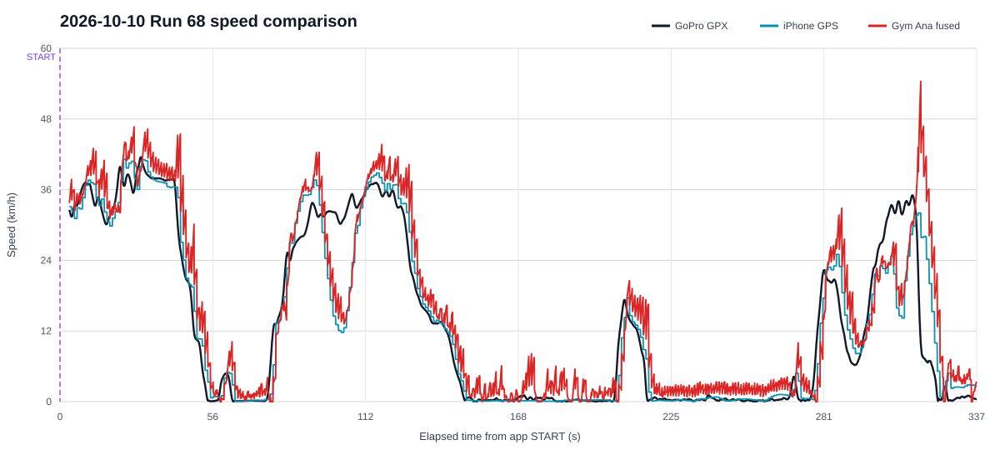

# 走行データ解析レポート（2026-10-10）

## 1. 対象データと対応付け

`C:\Users\foxho\Videos\20261010`のiPhone CSV、GoPro動画、GPXをUTC時刻と座標で照合した。

|データ|結果|
|---|---|
|`gym-ana-2026-10-10T06-46-03-006Z.csv`|`GX010068 (1).MP4`、`GX010068.gpx`と一致|
|`gym-ana-2026-10-10T03-24-11-010Z.csv`|一致するGoProデータなし|
|`GX010067 (1).MP4`、`GX010067.gpx`|一致するiPhone CSVなし|

走行68はGoPro開始`06:45:20.899Z`、アプリSTART`06:46:03.006Z`で、動画開始から`42.107秒`後に対応する。動画長は`386.019秒`、アプリログは`20,000`サンプル、`336.816秒`である。3軸ジャイロ、GPS観測時刻、ロールレートは全サンプルに保存され、IMU欠測はなかった。

走行67のGPX先頭18点は`2021-03-07`かつ座標`0,0`で無効である。有効区間は`2026-10-10 06:23:39Z`から`06:31:23Z`で、位置も短いCSVと異なる。短いCSVには`93.6秒`のIMU欠測があるため、モデル精度評価から除外した。

## 2. 速度評価

|指標|Gym Ana融合速度|iPhone GPS速度|
|---|---:|---:|
|GoPro GPSとの相関|0.951|0.959|
|RMSE|4.94 km/h|4.17 km/h|
|平均バイアス|+1.75 km/h|-0.33 km/h|
|最良時間シフト|-2.7秒|-1.6秒|

波形の形は追従しているが、融合速度はGoProに対して約2.7秒遅い。最大値も融合速度`54.40 km/h`に対してiPhone GPSは`41.21 km/h`で、IMU積分誤差をGPSが十分早く修正できていない。今回の平均GPS水平精度は`8.36 m`だった。

ログ再生で、人工抵抗なしを維持したまま速度プロセスノイズ、GPS観測標準偏差倍率、GPS遅延予測を探索した。GPS速度へ現在加速度を外挿する遅延予測は改善せず、採用しない。最良の安全側候補は次のとおりである。

|設定|2026-10-10 RMSE|バイアス|遅れ|2026-10-04 RMSE|バイアス|
|---|---:|---:|---:|---:|---:|
|従来実測|4.94|+1.75|-2.7秒|3.94|-3.39|
|抵抗0、Q速度1.2、GPS σ倍率0.35|4.42|+0.80|-1.9秒|2.07|-0.96|

単位は速度誤差がkm/hである。10月4日と10月10日の両方で改善したため、この候補を採用した。

## 3. 発進・停止

- Auto STARTはアプリ時刻0で発火したが、その時点のGoPro GPS速度は`28.37 km/h`だった。
- 原因は、走行中にAuto待機を有効にした場合も前後GだけでSTARTできたことである。
- STOPは手動操作で、アプリ`3.38 km/h`、GoPro`0.43 km/h`だった。今回は自動STOPの評価データではない。

対策として、Auto待機後に低運動かつGPS停止を`600 ms`確認するまではSTART判定と車体前後軸ロックを禁止した。GPSがない場合も低運動の確認を必要とする。確認後に画面を「静止確認中」から「発進待ち」へ切り替える。

## 4. 加速度とジャイロ

|信号|GoProとの相関|RMSE|時間シフト|
|---|---:|---:|---:|
|前後G|0.715|0.082 G|-0.1秒|
|左右G|0.262|0.041 G|+0.3秒|
|ヨーレート|0.406|6.25 deg/s|-0.1秒|

前後Gは速度更新に利用できる相関があり、時間遅れも小さい。左右Gとヨーは取付位置、座標変換、低運動区間の影響が大きいため、今回のデータだけで定数変更しない。

## 5. 実装変更

- 速度プロセスノイズを`0.45 * dt`から`1.2 * dt`へ変更した。
- GPS速度観測の標準偏差を従来値の`0.35倍`として、GPS補正を強くした。
- 人工抵抗係数は`0`を維持した。
- Auto START前に`600 ms`の静止確認を追加した。
- 走行中にAuto待機を押してもSTARTしない回帰テストを追加した。
- オフラインキャッシュを`v18`へ更新した。

## 6. 次回確認

1. ホーム画面アプリを完全終了して再起動し、`v18`を読み込む。
2. 停止中にAuto待機を押し、「静止確認中」から「発進待ち」へ変わってから発進する。
3. 自動STARTと自動STOPを最低2走行取得する。
4. 一定速、強い加速、強い制動を各5秒以上含める。
5. GoProとiPhoneの記録を同時に開始し、CSV、GPX、容量の大きいGoPro原本を残す。
