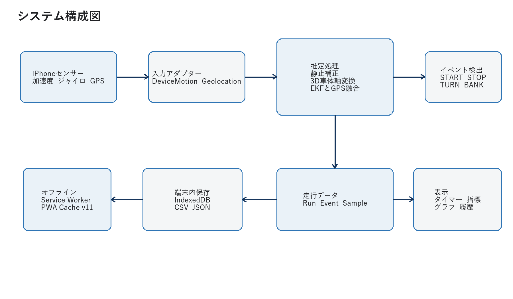
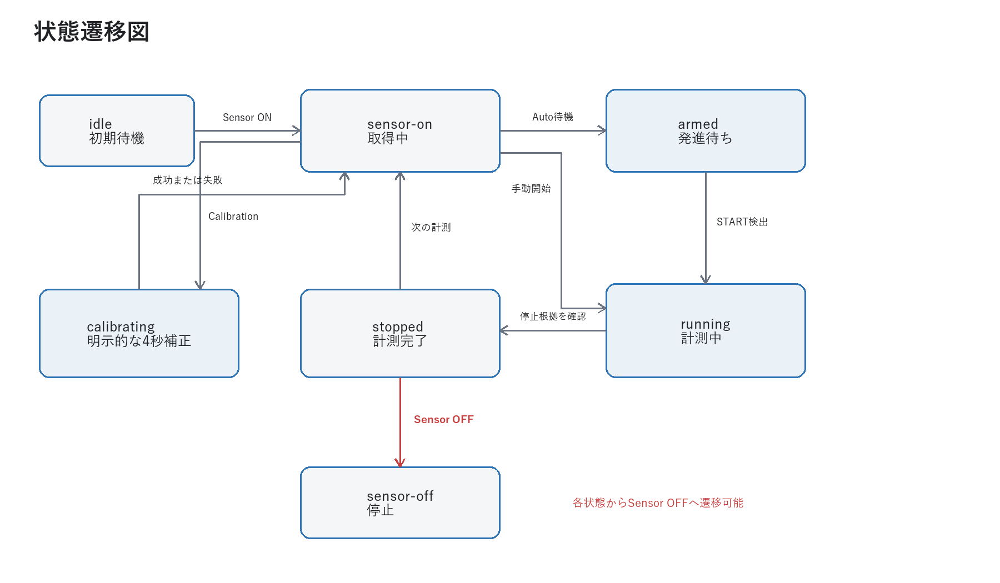
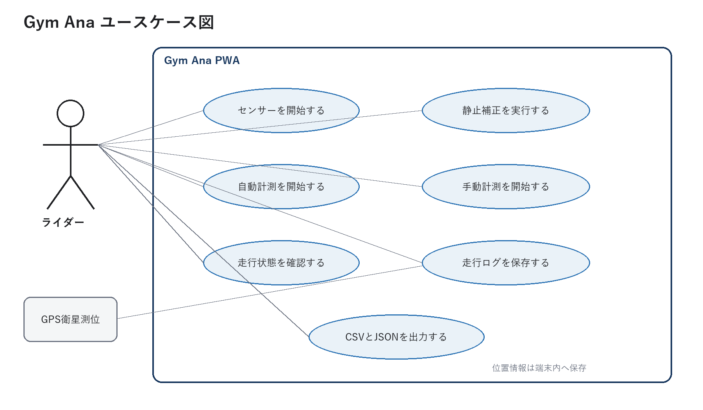
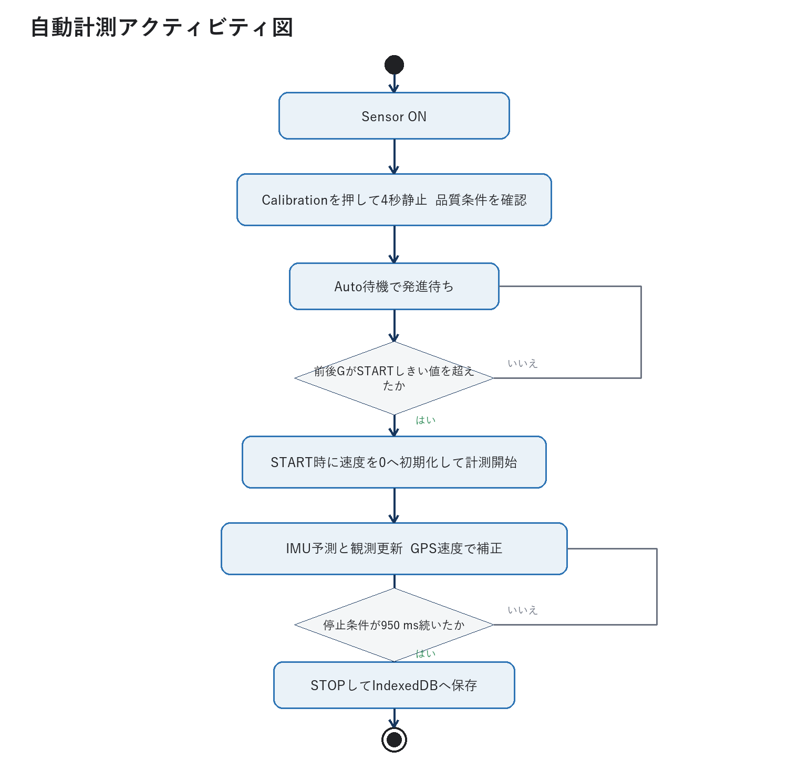
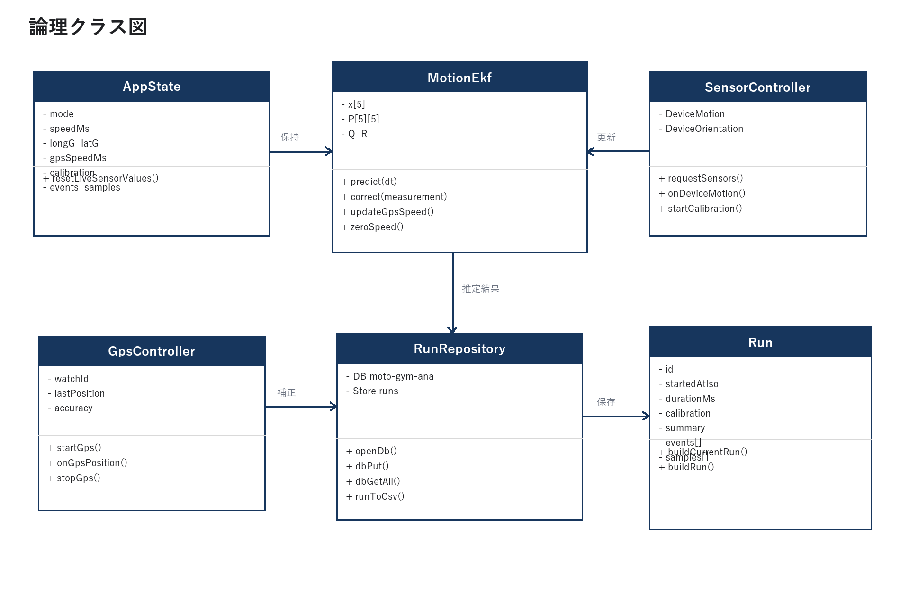

# Gym Ana システム設計書

## 1. 文書情報

| 項目 | 内容 |
| --- | --- |
| 対象システム | iPhoneセンサーによるモトジムカーナ走行計測PWA |
| 対象版 | Git commit `f59a182be130f11aa9ed83ecd22f9a53a35af496` |
| 作成日 | 2026-09-20 |
| 公開先 | `https://anyspoc.github.io/motogym_ana/` |
| 主対象 | iPhone Safariおよびホーム画面へ追加したPWA |

## 2. 目的と適用範囲

Gym Anaは、車体へ固定したiPhoneの内蔵センサーだけを利用し、モトジムカーナ走行の発進、停止、加減速、旋回、バンクおよび走行時間を記録する試験用アプリである。

現在版は次の用途を対象とする。

- 発進および停止の自動検出
- 手動または自動による走行タイム計測
- 前後G、左右G、ヨーレート、バンク角の推定
- IMU積分速度をGPS速度で補正した速度推定
- 走行単位の端末内保存とCSV、JSON出力
- 一度読み込んだ後のオフライン起動

公道用速度計、競技公式計時、安全制御または転倒検知装置としては使用しない。

## 3. 要求仕様

### 3.1 機能要求

| ID | 要求 |
| --- | --- |
| FR-01 | Sensor ON/OFFによりセンサー取得を明示的に開始、停止できること |
| FR-02 | Sensor OFF中は表示する計測値をゼロまたは未取得状態にすること |
| FR-03 | センサー開始時に静止キャリブレーションを実行すること |
| FR-04 | Auto ON/OFFにより自動計測を有効、無効にできること |
| FR-05 | Manual ON/OFFにより手動計測を開始、停止できること |
| FR-06 | 発進、停止、加速、減速、旋回、バンクを検出すること |
| FR-07 | GPSが利用可能な場合は推定速度の補正に使うこと |
| FR-08 | G、速度、バンク、旋回、分散、GPSを時系列保存すること |
| FR-09 | 保存済み走行をCSVまたはJSONで出力できること |
| FR-10 | 主要値を画面とグラフで確認できること |

### 3.2 非機能要求

| ID | 要求 |
| --- | --- |
| NFR-01 | iPhone SafariのHTTPS環境で動作すること |
| NFR-02 | PWAキャッシュ後はWi-Fiなしで起動できること |
| NFR-03 | 60 Hz程度のDeviceMotion入力を端末内で処理できること |
| NFR-04 | 1走行あたり最大20,000サンプルを保持すること |
| NFR-05 | データは外部送信せずIndexedDBへ保存すること |
| NFR-06 | センサーまたはGPSが利用できなくても画面が停止しないこと |

## 4. システム構成



```text
iPhone sensors
  DeviceMotion: acceleration, accelerationIncludingGravity, rotationRate
  DeviceOrientation: gamma
  Geolocation: position, speed, heading, accuracy
          |
          v
  Calibration and vehicle-axis projection
          |
          v
  Motion EKF <-------- GPS scalar speed update
          |
          +----> Event detector
          +----> Timer and graph
          +----> Run sample builder
                         |
                         v
                  IndexedDB / CSV / JSON
```

| ファイル | 責務 |
| --- | --- |
| `index.html` | 操作、状態、指標、グラフ、履歴の画面構造 |
| `styles.css` | iPhoneとPC向けレスポンシブ表示 |
| `app.js` | センサー、補正、EKF、GPS融合、検出、保存、出力 |
| `sw.js` | アプリシェルのオフラインキャッシュ |
| `manifest.webmanifest` | ホーム画面追加用PWA情報 |
| `tests/motion-model.test.mjs` | 推定器とCSV形式の回帰テスト |

## 5. 動作状態



| 状態 | 内容 | 主な遷移 |
| --- | --- | --- |
| `idle` | 初期待機 | Sensor ONで`calibrating` |
| `calibrating` | 4秒間の静止補正 | 完了後`sensor-on`または`armed` |
| `sensor-on` | センサー取得中、未計測 | Auto ONで`armed`、Manual ONで`running` |
| `armed` | 自動発進待ち | 前後Gしきい値超過で`running` |
| `running` | 計測中 | 自動停止、Manual OFF、Sensor OFFで`stopped` |
| `stopped` | 保存完了 | Auto ON、Manual ONまたはSensor OFF |
| `sensor-off` | センサー停止 | Sensor ONで`calibrating` |

Manual ONはキャリブレーション完了前には開始しない。Auto ONは補正中に押しても補正完了後に発進待ちとなる。

### 5.1 ユースケース図



### 5.2 自動計測アクティビティ図



### 5.3 論理クラス図



実装は単一の`app.js`を中心とするが、クラス図では保守時の責務を明確にするため、状態、推定、センサー、GPS、保存、走行データの論理クラスへ分解している。`MotionEkf`だけが実クラスで、その他は状態オブジェクトと関数群で構成される。

## 6. センサーと座標系

### 6.1 入力

- `acceleration`: 重力を除いた端末X、Y、Z加速度、単位 `m/s^2`
- `accelerationIncludingGravity`: 重力を含む端末X、Y、Z加速度
- `rotationRate.alpha`: ヨーレートとして使用、単位 `deg/s`
- `DeviceOrientation.gamma`: 3軸姿勢推定が成立しない場合のバンク角補助値
- `GeolocationCoordinates.speed`: GPS速度、単位 `m/s`
- `accuracy`: 水平位置精度、単位 `m`
- `heading`: GPS方位、単位 `deg`

加速度は標準重力加速度 `g0 = 9.80665 m/s^2` で除算し、G単位へ変換する。

### 6.2 静止キャリブレーション

Sensor ON後、`Tcal = 4.0 s`の静止サンプル平均から次を求める。

```text
b_a = mean([a_x, a_y, a_z])
b_w = mean(yaw_rate)
g_d = normalize(mean(accelerationIncludingGravity))
```

`b_a`は加速度オフセット、`b_w`はヨーオフセット、`g_d`は端末座標上の静止重力方向である。走行中の補正済み加速度は`a_c = a_raw - b_a`とする。

### 6.3 エンジン振動除去

補正済み3軸加速度は、車体座標の決定、イベント判定、速度積分の前に時定数`0.08 s`の一次低域通過フィルタへ通す。

```text
alpha = 1 - exp(-dt / 0.08)
a_lp = a_lp + alpha * (a_c - a_lp)
```

エンジン振動は正負が高速に反転するため`a_lp`では減衰し、持続する車体加減速は残る。`a_c - a_lp`の二乗平均を時定数`0.35 s`で追跡し、振動量`vibrationG`として内部保持する。自動STARTは前後Gがしきい値を`140 ms`継続した場合にだけ成立させ、計測開始時刻は継続判定の先頭へ戻す。

静止補正は、START待機時と同じエンジンアイドリング状態で実行することを推奨する。回転数や取付状態が大きく変わった場合はSensor OFF、ONで再補正する。

### 6.4 車体座標の決定

発進待ちまたは走行中に、補正済み加速度から重力方向成分を除く。

```text
a_h = a_c - dot(a_c, g_d) * g_d
```

`|a_h| >= 0.08 G`となった最初の明確な加速で車体前方向と左右方向を決定する。

```text
e_forward = normalize(a_h)
e_lateral = normalize(cross(g_d, e_forward))
longitudinal_g = dot(a_c, e_forward)
lateral_g = dot(a_c, e_lateral)
```

バンク角は現在重力方向`g_now`を使い、次式で求める。

```text
bank = atan2(dot(g_now, e_lateral), dot(g_now, g_d))
```

## 7. 状態推定

### 7.1 状態ベクトル

現行推定器は5状態の拡張カルマンフィルタである。

```text
x = [v, a_long, a_lat, yaw_rate, bank]^T
```

- `v`: 前進速度、`m/s`
- `a_long`: 前後加速度、G
- `a_lat`: 左右加速度、G
- `yaw_rate`: ヨーレート、`deg/s`
- `bank`: バンク角、`deg`

### 7.2 物理モデル

サンプル間隔を`dt`、抵抗係数を`c_d = 0.025`とする。

```text
v_k = max(0, v_(k-1) + (a_long * g0 - c_d * v_(k-1)) * dt)
a_long_k = a_long_(k-1) * exp(-dt / 0.7)
a_lat_k = a_lat_(k-1) * exp(-dt / 0.7)
yaw_k = yaw_(k-1) * exp(-dt / 0.5)
bank_k = bank_(k-1) + blend * (atan(a_lat) - bank_(k-1))
```

状態遷移ヤコビアン`F`で共分散を予測する。

```text
P_k^- = F P_(k-1) F^T + Q
```

`Q`は速度、加速度、ヨー、バンクのモデル誤差を表す。`dt`は`0.005`から`0.12 s`へ制限し、Safari停止復帰時の過大積分を防ぐ。

### 7.3 IMU観測モデル

```text
z_imu = [measured_long_g, measured_lat_g, measured_yaw_rate, measured_bank]^T
H_imu = [0 I_4]
```

更新式は次のとおり。

```text
y = z - Hx
S = HPH^T + R
K = PH^T S^-1
x = x + Ky
P = (I - KH)P
```

観測ノイズ対角値は`R = diag([0.012, 0.012, 9, 12])`である。

### 7.4 GPS速度観測

GPS速度が取得できる場合は`z_gps = speed`を使う。取得できない場合は、連続するGPS位置からHaversine距離を求めて速度を算出する。

```text
H_gps = [1, 0, 0, 0, 0]
```

直接速度の標準偏差は`clamp(accuracy * 0.06, 0.4, 3.0)`、位置差速度は`clamp(accuracy * 0.25, 1.2, 5.0)`とする。水平精度が50 mを超える測位、負速度、90 m/sを超える速度は更新に使わない。

GPS更新周期はIMUより遅いため、IMU更新とは独立したスカラー観測更新として実装する。

### 7.5 ゼロ速度更新

次の条件が450 ms続いた場合、速度をゼロへ拘束する。

```text
|a_long| < 0.035 G
|a_lat| < 0.040 G
|yaw_rate| < 3.5 deg/s
```

START時にも速度状態と速度関連共分散をゼロへ戻し、発進待ち中の積分値を走行へ持ち越さない。

## 8. イベント検出

| 感度 | START G | 加速 G | 減速 G | 旋回 deg/s | バンク deg | deadband G |
| --- | ---: | ---: | ---: | ---: | ---: | ---: |
| 低 | 0.26 | 0.32 | -0.34 | 48 | 24 | 0.035 |
| 標準 | 0.20 | 0.26 | -0.30 | 40 | 20 | 0.025 |
| 高 | 0.14 | 0.19 | -0.22 | 30 | 15 | 0.014 |

自動停止は推定速度`v < 0.65 m/s`、`|a_long| < 0.05 G`、`|a_lat| < 0.06 G`が950 ms継続し、START後1.5秒以上経過した場合に成立する。同種イベントは900 ms以内の再登録を抑制する。

## 9. データ設計

### 9.1 走行単位

各走行は次の構造でIndexedDBへ保存する。

```text
run
  id
  startedAtIso / endedAtIso / durationMs
  calibration
  summary
  events[]
  samples[]
```

### 9.2 主要サンプル項目

| 項目 | 単位 | 内容 |
| --- | --- | --- |
| `timeMs` | ms | STARTからの経過時間 |
| `longG`, `latG` | G | EKF後の前後、左右加速度 |
| `speedKmh` | km/h | IMUとGPSを融合した推定速度 |
| `gpsSpeedKmh` | km/h | GPS観測速度 |
| `gpsAccuracyM` | m | GPS水平精度 |
| `latitude`, `longitude` | deg | GPS位置 |
| `gpsHeadingDeg` | deg | GPS方位 |
| `bankDeg` | deg | バンク角 |
| `yawRate` | deg/s | ヨーレート |
| `vibrationG` | G | 低域通過フィルタで除去した高周波振動のRMS |
| `longGVariance`, `latGVariance` | G^2 | 移動窓分散 |
| `kalmanVariance` | mixed | 主要状態共分散の平均指標 |
| `confidence` | % | 入力有無、周期、姿勢値による簡易指標 |

1走行のサンプル上限は20,000件である。60 Hzでは約5.6分、30 Hzでは約11.1分に相当する。

## 10. 保存とオフライン

- IndexedDBのDB名は`moto-gym-ana`、ストア名は`runs`とする。
- STOP時に走行データを自動保存する。
- CSVはイベント行とサンプル行を同じ列定義で出力する。
- JSONはキャリブレーションベクトルを含むため、詳細解析ではJSONを優先する。
- Service Workerは`moto-gym-ana-v11`としてアプリシェルをキャッシュする。
- iOSは容量圧迫時にWebデータを削除する可能性があるため、重要データは走行後に出力する。

## 11. 試験設計

### 11.1 自動試験

`tests/motion-model.test.mjs`で次を検証する。

- 4秒静止後にキャリブレーションが完了すること
- 重力方向が正規化されること
- 3軸前方向が発進加速度で決定されること
- START時速度が0 km/hであること
- 0.3 Gを2秒与えた速度が物理的範囲に収まること
- 静止継続で速度が0へ戻ること
- GPS観測で速度状態が補正されること
- CSVの全行が同じ列数になること

### 11.2 iPhone実機試験

1. 固定状態でSensor ONし、4秒間静止する。
2. GPS精度20 m以下を目安に待つ。
3. 既知距離20 m以上の直線を一定方向に走る。
4. 静止、発進、一定速、制動、完全停止を含める。
5. CSVとJSONを出力し、GPS速度、推定速度、動画または距離時間速度を比較する。
6. 右旋回と左旋回を行い、ヨーとバンクの符号を確認する。

## 12. 既知の制約と今後の設計

- 最初の大きな水平加速度を前方向とするため、横揺れや衝撃で誤学習する可能性がある。
- GPS速度の誤差分散を位置精度から近似しており、速度専用精度ではない。
- 現在の状態はスカラー前進速度で、東西、南北速度や走行軌跡を状態に含めていない。
- SafariのDeviceMotion値はiOS版、端末、取付振動の影響を受ける。
- `confidence`は統計的な推定信頼区間ではなく、入力健全性の簡易表示である。
- バンク中の重力ベクトルには並進加速度が混入する。

次段階では、取付方向の手動確定、GPS速度残差の外れ値判定、2次元速度状態、ジャイロバイアスのオンライン推定を優先する。UKFは姿勢クォータニオンやタイヤスリップなど、強い非線形モデルを導入する段階で再評価する。粒子フィルタは複数の運動仮説を同時に保持する必要が生じるまで採用しない。

## 13. 安全とプライバシー

- 端末を確実に車体へ固定し、閉鎖された安全な場所で試験する。
- 走行中に画面操作を行わない。
- GPS位置は端末のIndexedDBと出力ファイルに保存される。
- アプリ自身はログをサーバーへ送信しない。
- CSV、JSONを共有する場合は位置情報を含むことを確認する。
